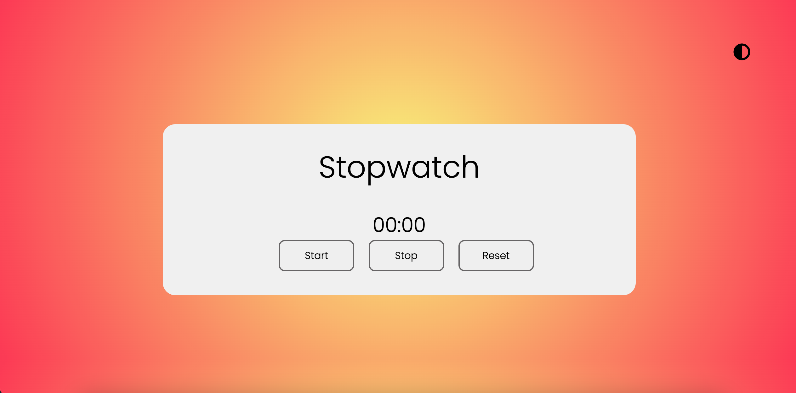
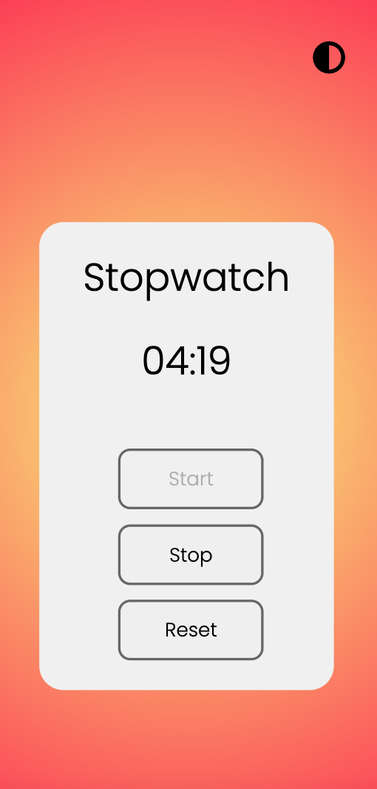
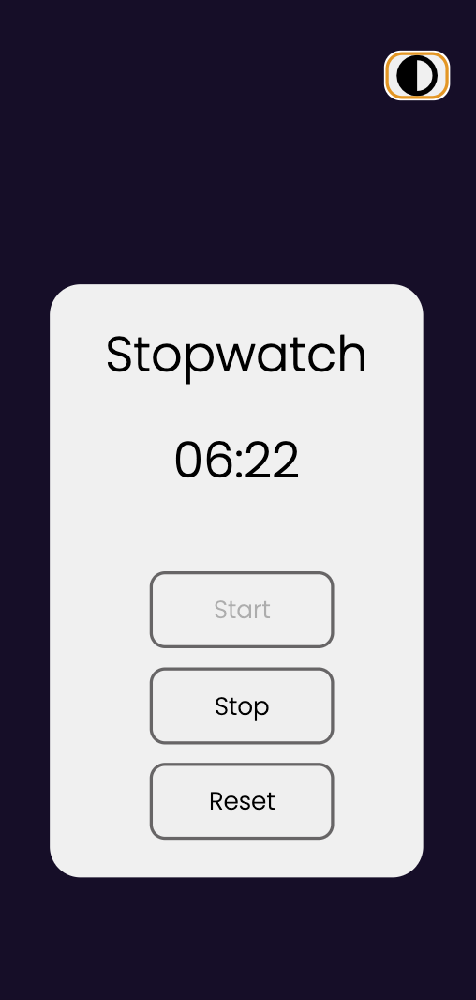

## An Everyday Stopwatch :alarm_clock:

This stopwatch was created in order to test my skills in JavaScript.
My idea was to create a project where I would use more JS then HTML and CSS since my previous projects hd focus more on those two.

It was fun developing this stopwatch. I thought I would need more time to finsh the project. Being able to do it fast came as a nice surprise and guess what? As an extra, I implemented light and dark-mode.

## Light and Dark Mode :vampire:

https://user-images.githubusercontent.com/85224824/202324104-43b61bc4-7df6-4931-8da0-38c659bc92c3.mp4

## Technologies used :hammer_and_wrench:

- [JavaScript](https://www.javascript.com)
- [HTML5](https://html.com)
- [CSS3](https://www.w3.org/Style/CSS/Overview.en.html)

## Requirements :computer:

To work with the code, you will need, before you begin, to install in your machine [Git](https://git-scm.com). Also, it's a good idea to have a source-code editor like [VSCode](https://code.visualstudio.com/).

## How to use it :white_check_mark:

**1.** Click on the play button to start counting the time; 
**2.** Use the stop button to stop and the reset to start couting from the beggining; 
**3.** In order to switch light-dark mode, press the toggle button on the upper right corner.

### See video bellow

https://user-images.githubusercontent.com/85224824/202325668-0d17a4ea-39e0-4fe8-9688-b47b670176f3.mp4

## Go mobile :iphone:

Stopwatch layout style was also designed to support mobile.

  
  

## Try it out!

Link to live website: https://stopwatch-projeto.netlify.app

